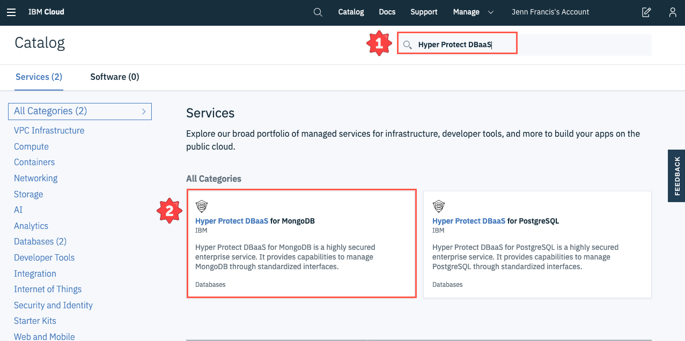
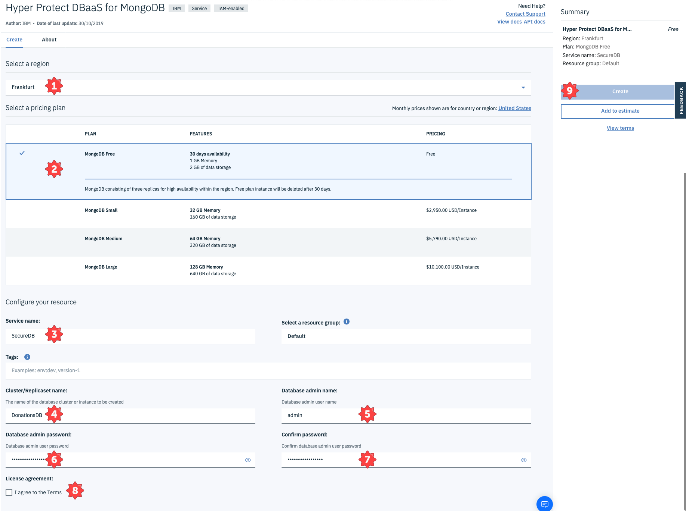
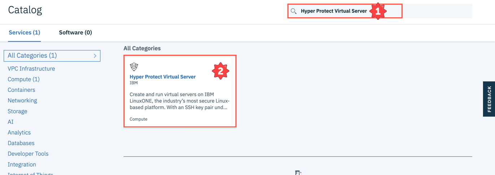
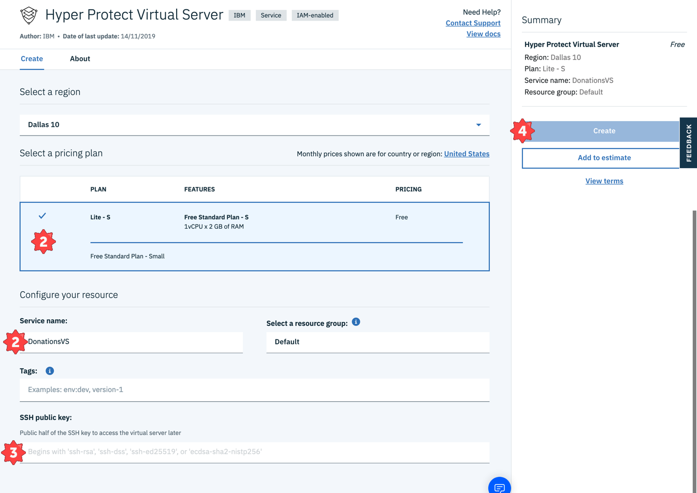
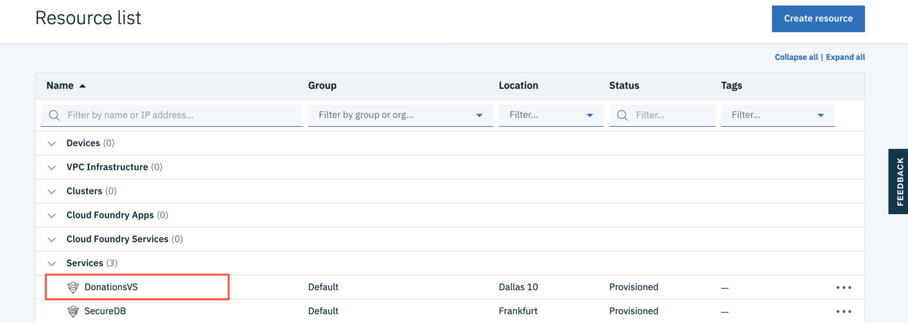
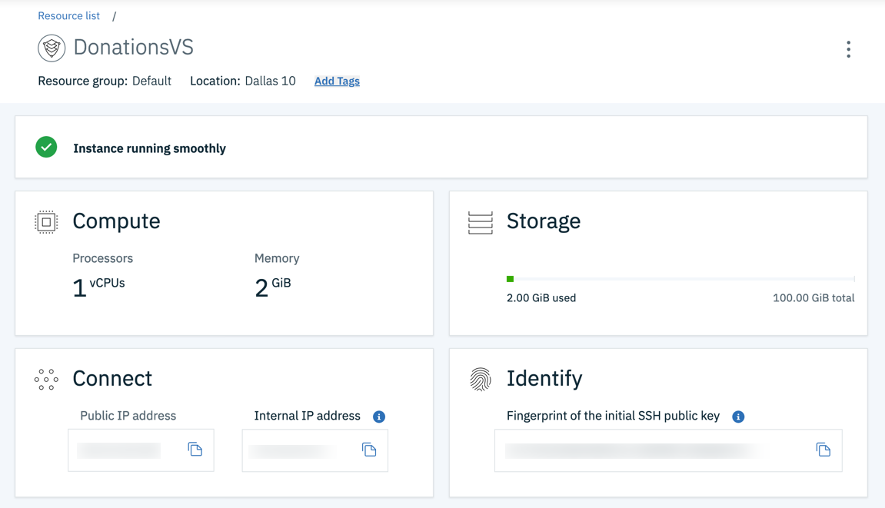

# Backend Disaster Donations Application

This directory contains the backend application to the disaster
donations website.

It's a simple python application that takes in transaction data over
an exposed RESTful API (JSON payload expected), and translates into
calls to a backend Mongo DB instance.

For a cloud-based Mongo instance to use, we will be using a [IBM Cloud Hyper Protect DBaaS for
MongoDB](https://cloud.ibm.com/catalog/services/hyper-protect-dbaas-for-mongodb)
instance.

## Create your MongoDB service

1. From the [IBM Cloud Catalog](https://cloud.ibm.com/catalog), search for *Hyper Protect DBaaS* and select **Hyper Protect DBaaS for MongoDB**.

   

2. Complete the following fields to start your MongoDB service.

   * Select a region: *Frankfurt*
   * Service name: *SecureDB*
   * Cluster/Replicaset name: *DonationsDB*
   * Database admin name: *admin*
   * Database admin password: *xxxxxxxxxxx*
   * Check: *I agree to the Terms*
   * **Select** *Create*.

   

3. Carry on to the next section while your database is provisioning.

## Create your virtual server

1. From the [IBM Cloud Catalog](https://cloud.ibm.com/catalog), search for *Hyper Protect Virtual Server* and select **Hyper Protect Virtual Server**.

   

2. Complete the following fields to create your virtual server.

   * Select the  **Lite** plan.

   * Enter a *Service name*: DonationsVS

   * Copy and paste in the public half of a SSH key. If you don't one already, please follow the guide [here]( https://cloud.ibm.com/docs/vpc?topic=vpc-ssh-keys).

   * Select **Create**.

     

3. Once your virtual server is provisioned, **click** on *DonationsVS* from the Resource list to open up the details page. 

   

   

4. Open a ssh-capable terminal on your local machine. We will use the terminal to SSH into the virtual server. You will need to obtain the following information:

   * Obtain the IP of the virtual server from the details you opened in the prior step

   * Locate the private key you created earlier on your local machine.

     ```
     ssh -i your_private_key root@your.public.ip.address
     ```

     

5. 


## Build and Run the Backend Application

We will be running a python backend application that directs the web front endto talk to MongoDB in the backend. [`config.py`](./config.py) contains the hostname or IP address, and port of a listening Mongo DB instance. To make things easier, config.py has been setup with environment variables that will be initialised when we start our Docker container. 

The backend application will listen on port `5000`. The application reads your Mongo instance username and password from environment variables, passed through into the Docker container with the `-e` flag. The base Docker image used is multi-arch compatible.


**Run the following command(s) to create and run your Docker container:** 

```
docker build -t disaster-backend .

docker run -dp 5000:5000 -e PASSWORD='your_password' -e USERNAME='your_username' -e DBNAME='your_db_name' -e ENDPOINT='primary_hostname:port' -e REPLICASET='replica_set_name' disaster-backend
```


You can find the variables needed for the command above by selecting your service from the *Resource List*. 


## Test the Application

To confirm that the application is running, issue

```
curl 'localhost:5000/'
```

and the following JSON should be returned:

```
{
  "apiVersion": "v1.0", 
  "message": "Welcome to the Disaster Funding API", 
  "status": "200"
}
```

The application accepts a JSON payload in the form in
[`transaction.json`](./transaction.json).

```
curl -vX POST 'localhost:5000/api/v1/transactions' -d @transaction.json --header "Content-Type: application/json"
```

You can confirm this has worked using a Mongo client and checking that
the DB has been populated. For example, use [Robo
3T](https://robomongo.org). The name for the database in this pattern
is `restfulapi`, so look for objects created here.