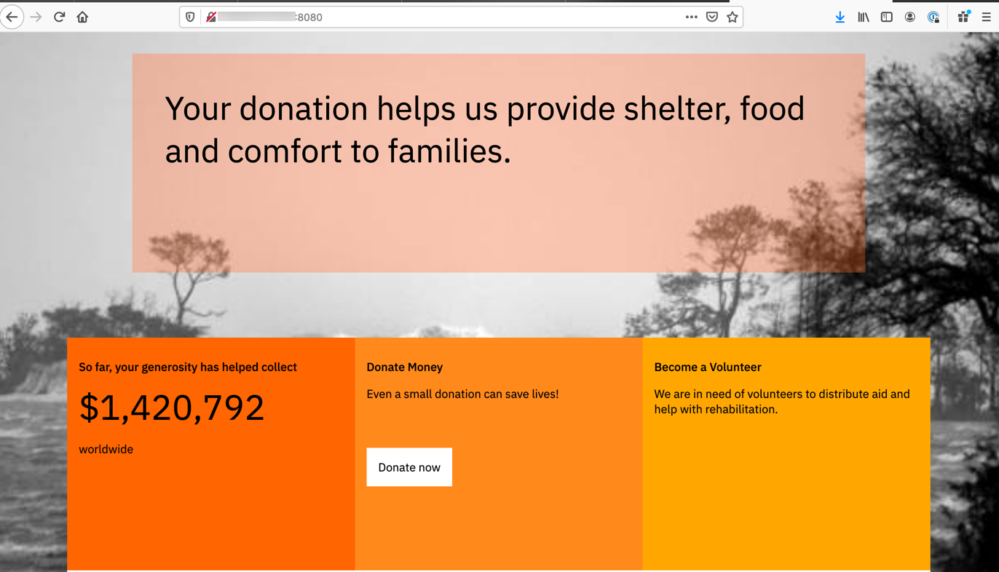
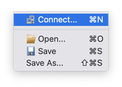
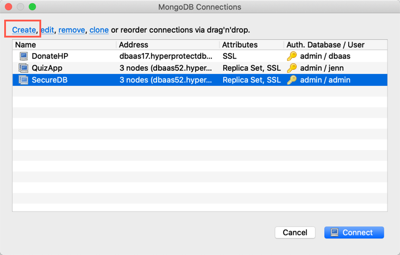
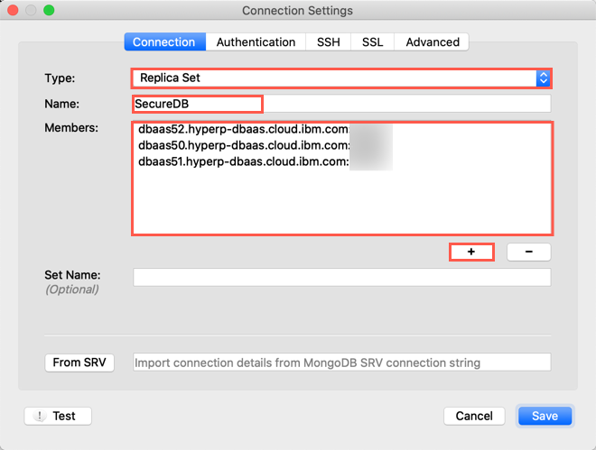
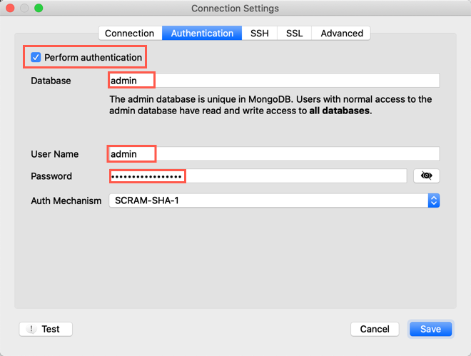
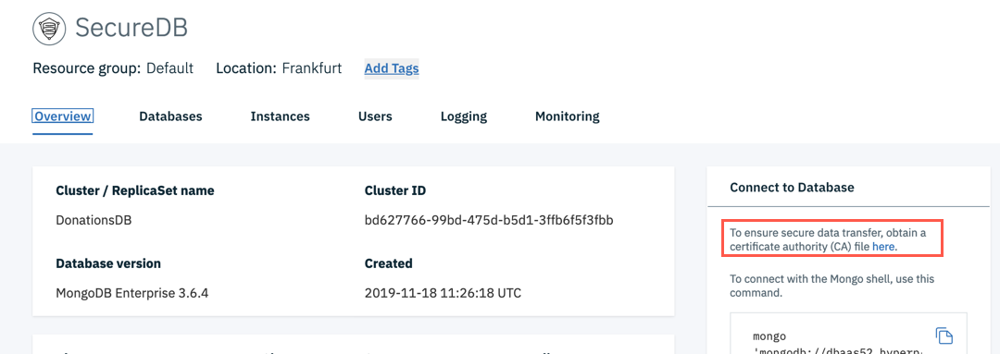
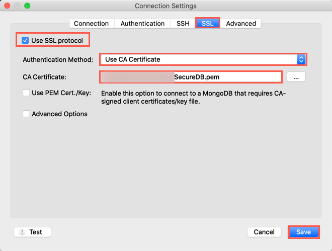
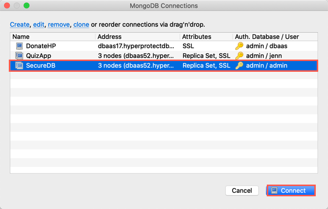
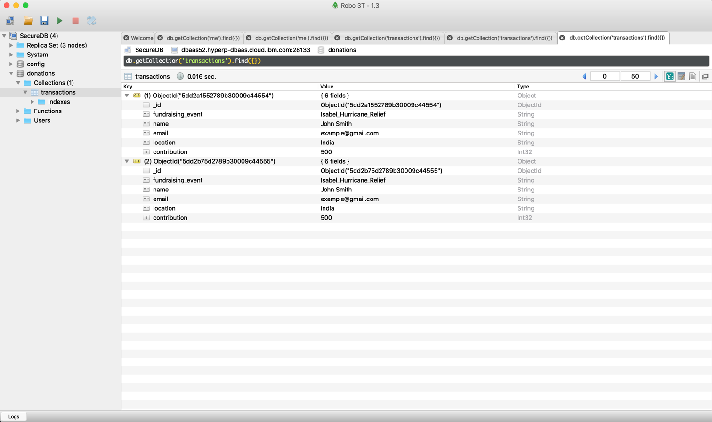

# Frontend Disaster Donations Application

This is the frontend application that serves the disaster donations
website. It's a fairly simple node.js (Express) app, serving static
HTML. The donations page uses AJAX to call to the backend, running on
the same machine, to retrieve and save donations information.

As with the backend, you can run this app locally or deploy it to a
VM in a cloud environment. For our example,  we will deploy it to an [IBM Cloud
Hyper Protect Virtual Server](https://cloud.ibm.com/catalog/services/hyper-protect-virtual-server) instance. With this option, you can ensure that the storage used for this app is encrypted. By running the backend application on the same service then it is secured too.


We've already created the Hyper Protect Virtual server, so now we're ready to run the application.


## Build and Run the Application

The application listens both on port `8080` and
`8443`. Use the following commands to build your docker container:

```
cd $HOME/secure-cloud/frontend
docker build -t disaster-frontend .
docker run -d -p8080:8080 -p8443:8443 disaster-frontend
```


## Test the Application

1. Use a web browser to navigate to`your_public_ip:8080` and confirm that the
   donations homepage loads. 

   * You can find your public IP in the details of your Hyper Protect Virtual Server.

     

2. On the webpage, try out that functionality, driving AJAX calls to issue `GET` and `POST` requests to the backend application. 

3. If you want to see the information populated in the database, install [Robo3T](https://robomongo.org/download) on your local machine.

4. To configure Robo3T, complete the following steps

   * Open Robo3T, **select** *File* -> *Connect*.

     

   * From the pop-up dialog, select *Create*.

     

   * In the connection settings:

     *  **Select** *Replica set*

     * Enter a *connection name* 

     * Edit the members by double clicking on them and using the `+` to add all 3 members shown in the details of your Hyper Protect DBaaS details.

       

   * Under the Authentication tab:

     * **Check** *perform authentication*.

     * Enter Database name of *admin*.

     * Enter the username of *admin*.

     * Enter the password you created.

       

   * Under the SSL tab:

     * **Check** *Use SSL protocol.*

     * **Select** *Use CA Certificate*.

     * Download the Certifcate from the details of the DBaaS service and save to your local system. 

       

       * **Click** *Save*.

       

5. Highlight your new connection name and click connect.

   

6. **Expand** your database and then **double-click** on *transactions.*

   